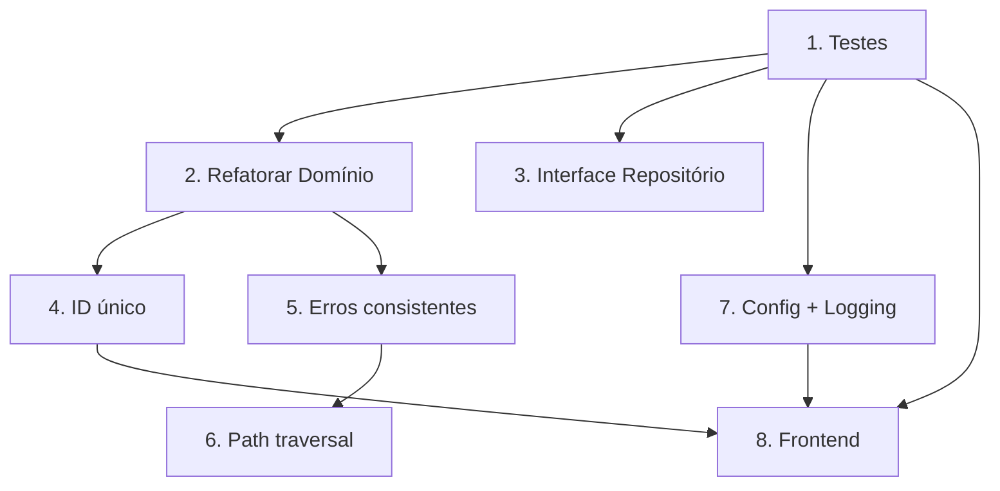

# Plano de Melhoria — hora_calc (Somador de Horas)

> **Fase 4: Plan** — Workflow `brownfield-discovery`
> **Data:** 2026-07-19
> **Agente:** aiox-architect + writing-plans
> **Baseado em:** `docs/discovery/mapa-da-codebase.md` + `docs/discovery/analise-completa.md`

---

## Sumário Executivo

**15 débitos técnicos identificados:**
- **Crítico:** 1 (Zero testes)
- **Alta:** 4 (Modelo anêmico, Índice como ID, Erros inconsistentes, Path traversal)
- **Média:** 7 (Validação duplicada, Sem interface, HTML/JS monolítico, Sem ambiente, Logging, Cache CSV, Config dev/prod)
- **Baixa:** 3 (CSS, 480 hardcoded, Formatação duplicada, Dados calculados)

**Esforço total estimado:** ~40-60 horas

---

## 1. Problemas Encontrados (Priorizados)

### 🔴 Críticos (Fazer IMEDIATAMENTE)

| # | Problema | Categoria | Impacto | Esforço |
|---|----------|-----------|---------|---------|
| 1 | **Zero testes** — Nenhum teste de qualquer tipo | Quality | Impede refatoração segura, sem garantia de regressão | **Large** (16-24h) |

### 🟠 Altos (Fazer nesta sprint)

| # | Problema | Categoria | Impacto | Esforço |
|---|----------|-----------|---------|---------|
| 2 | **Modelo Meeting anêmico** — Validação vazou, sem identidade | Domain | Bugs, manutenção difícil | **Medium** (4-8h) |
| 3 | **Índice de CSV como ID** — Frágil, sem atomicidade | Infrastructure | Perda de dados em concorrência | **Medium** (4-6h) |
| 4 | **Tratamento de erros inconsistente** | Reliability | UX pobre, debug difícil | **Medium** (3-5h) |
| 5 | **Path traversal no CSV viewer** | Security | Vulnerabilidade de segurança | **Medium** (2-4h) |

### 🟡 Médios (Fazer nas próximas sprints)

| # | Problema | Categoria | Impacto | Esforço |
|---|----------|-----------|---------|---------|
| 6 | **Sem interface de repositório** | Architecture | Acoplamento, difícil testar | **Medium** (3-5h) |
| 7 | **HTML/JS monolítico** — Lógica de negócio no frontend | Frontend | Manutenção difícil | **Large** (8-16h) |
| 8 | **Sem configuração de ambiente** | DevOps | Erros em deploy | **Small** (1-2h) |
| 9 | **Sem logging** | Observability | Debug cego em produção | **Small** (2-3h) |
| 10 | **Sem cache de leitura CSV** | Performance | Lentidão em arquivos grandes | **Medium** (2-4h) |

### 🟢 Baixos (Melhoria contínua / Nice-to-have)

| # | Problema | Categoria | Impacto | Esforço |
|---|----------|-----------|---------|---------|
| 11 | **480 hardcoded** (8h diário) | Code Smell | Inflexibilidade | **Small** (0.5h) |
| 12 | **Validação de duração duplicada** | Code Smell | Manutenção | **Small** (0.5h) |
| 13 | **Formatação de duração duplicada** | Code Smell | Manutenção | **Small** (0.5h) |
| 14 | **CSS sem metodologia** | Frontend | Escalabilidade | **Medium** (4-6h) |
| 15 | **Dados calculados persistidos em CSV** | Data | Redundância | **Small** (1h) |

---

## 2. Ações Recomendadas

### 2.1 🔴 Crítico: Implementar Testes

**Esforço:** Large (16-24h) | **Prioridade:** #1 | **Dependências:** Nenhuma

#### Recommended approach (3 camadas):

**Layer 1 — Testes Unitários (8-10h)**
```
tests/
├── unit/
│   ├── domain/
│   │   └── test_models.py              # Meeting, validações
│   ├── use_cases/
│   │   └── test_meeting_use_cases.py   # Cada caso de uso
│   └── infrastructure/
│       └── test_csv_repository.py      # CSV com tempfile
```

- `pytest` + `pytest-cov` como dependências de dev
- Mock de arquivos CSV com `tempfile` e `pathlib`
- Testar: criação, validação, edge cases (horário virado, nomes vazios)

**Layer 2 — Testes de Integração (4-6h)**
```
tests/
└── integration/
    └── test_api.py                     # FastAPI TestClient
```

- `httpx` + `TestClient` do FastAPI
- Testar cada endpoint (sucesso e erro)
- Setup/teardown com CSV temporário

**Layer 3 — CI Setup (2-3h)**
```
.github/
└── workflows/
    └── ci.yaml                         # pytest on push/PR
```

- GitHub Actions com Python 3.11+
- `pytest --cov --cov-fail-under=80`
- Lint: `ruff` (alternativa leve ao flake8)

**Critérios de Sucesso:**
- [ ] `pytest` roda e passa
- [ ] Cobertura mínima de 80%
- [ ] CI executa em cada push
- [ ] Testes unitários não dependem de arquivos reais (`data/`)

---

### 2.2 🟠 Alto: Refatorar Modelo de Domínio

**Esforço:** Medium (4-8h) | **Prioridade:** #2 | **Dependências:** Testes (item 1)

#### Ações:

1. **Adicionar identidade à Meeting**
   ```python
   @dataclass
   class Meeting:
       meeting_id: str = field(default_factory=lambda: str(uuid.uuid4())[:8])
   ```

2. **Adicionar `__post_init__` com validações**
   ```python
   def __post_init__(self):
       if not self.name or not self.name.strip():
           raise ValueError("Meeting name cannot be empty")
       if self.start_time >= self.end_time:
           raise ValueError("End time must be after start time")
       if len(self.name) > 200:
           raise ValueError("Meeting name too long")
   ```

3. **Criar Value Objects**
   ```python
   @dataclass(frozen=True)
   class TimeInterval:
       start: time
       end: time
       def __post_init__(self):
           if self.start >= self.end:
               raise ValueError("End time must be after start time")
       @property
       def duration_minutes(self) -> int: ...
   
   @dataclass(frozen=True)
   class MeetingName:
       value: str
       def __post_init__(self):
           if not self.value.strip():
               raise ValueError("Name cannot be empty")
           if len(self.value) > 200:
               raise ValueError("Name too long")
   ```

4. **Extrair validação do use case** — Remover `if duration_minutes <= 0` de `register_meeting` e `update_meeting`, pois passa a estar no modelo.

5. **Adicionar método de domínio**
   ```python
   def reschedule(self, new_start: time, new_end: time) -> None:
       """Reagenda reunião mantendo invariantes"""
       if new_start >= new_end:
           raise ValueError("End time must be after start time")
       self.start_time = new_start
       self.end_time = new_end
   ```

**Critérios de Sucesso:**
- [ ] Meeting valida seus próprios dados
- [ ] Use cases não têm validação duplicada
- [ ] Testes passam (escritos primeiro)
- [ ] Dados legados continuam funcionais

---

### 2.3 🟠 Alto: Substituir Índice por ID Único

**Esforço:** Medium (4-6h) | **Prioridade:** #3 | **Dependências:** Item 2

#### Ações:

1. **Adicionar `meeting_id` ao CSV** — Nova coluna `ID` no cabeçalho
2. **Migração de dados** — Script para adicionar IDs aos CSVs existentes
3. **Atualizar repositório** — `update_by_index` → `update_by_id`, `delete_by_index` → `delete_by_id`
4. **Atualizar rotas** — `PUT /reunioes/{meeting_id}`, `DELETE /reunioes/{meeting_id}`
5. **Compatibilidade reversa** — Aceitar `index` como fallback por 1 sprint

**Alternativa:** UUID (mais seguro) vs hash incremental (mais simples)
- **Recomendação:** UUID hex curto (8 chars) — `a1b2c3d4`

**Critérios de Sucesso:**
- [ ] CRUD funciona com ID em vez de índice
- [ ] Dados antigos migrados
- [ ] CSV viewer mostra IDs
- [ ] Testes passam

---

### 2.4 🟠 Alto: Tratamento de Erros Consistente

**Esforço:** Medium (3-5h) | **Prioridade:** #4 | **Dependências:** Nenhuma

#### Ações:

1. **Criar exceptions de domínio**
   ```python
   # app/domain/exceptions.py
   class MeetingError(Exception): ...
   class InvalidMeetingDurationError(MeetingError): ...
   class MeetingNotFoundError(MeetingError): ...
   class EmptyMeetingNameError(MeetingError): ...
   ```

2. **Criar error handler global no FastAPI**
   ```python
   @app.exception_handler(MeetingError)
   async def meeting_error_handler(request, exc):
       return JSONResponse(status_code=400, content={"error": exc.__class__.__name__, "detail": str(exc)})
   ```

3. **Padronizar respostas de erro**
   ```json
   {
     "error": "InvalidMeetingDurationError",
     "detail": "End time must be after start time",
     "timestamp": "2026-07-19T10:00:00Z"
   }
   ```

4. **Adicionar validação de input nas rotas** — Sanitizar e validar antes de chamar use cases

**Critérios de Sucesso:**
- [ ] Todas as exceptions têm classes específicas
- [ ] Respostas de erro são padronizadas
- [ ] Frontend trata erros de forma consistente
- [ ] Logs incluem stack traces

---

### 2.5 🟠 Alto: Corrigir Path Traversal

**Esforço:** Medium (2-4h) | **Prioridade:** #5 | **Dependências:** Nenhuma

#### Ações:

1. **Sanitizar nome de arquivo**
   ```python
   import re
   SAFE_PATTERN = re.compile(r'^Horas_\d{2}-\d{2}-\d{4}\.csv$')
   
   def read_file(self, filename: str) -> list[dict] | None:
       if not SAFE_PATTERN.match(filename):
           raise ValueError("Invalid filename")
       file_path = self._data_dir / filename
       # Verificar se está dentro do diretório data/
       if not str(file_path.resolve()).startswith(str(self._data_dir.resolve())):
           raise ValueError("Path traversal detected")
   ```

2. **Restringir acesso a apenas arquivos CSV existentes** — Levar validado

**Critérios de Sucesso:**
- [ ] Tentativas de path traversal retornam 400
- [ ] Apenas arquivos `Horas_*.csv` são acessíveis
- [ ] Teste com payloads maliciosos

---

### 2.6 🟡 Médio: Interface de Repositório

**Esforço:** Medium (3-5h) | **Prioridade:** #6 | **Dependências:** Item 2

#### Ações:

1. **Criar protocol ABC**
   ```python
   # app/domain/repositories.py
   from abc import ABC, abstractmethod
   
   class MeetingRepository(ABC):
       @abstractmethod
       def save(self, meeting: Meeting) -> None: ...
       @abstractmethod
       def find_by_date(self, meeting_date: date) -> list[Meeting]: ...
       # ... outros métodos
   ```

2. **Implementar no CSV**
   ```python
   class CsvMeetingRepository(MeetingRepository): ...
   ```

3. **Tipar o use case**
   ```python
   class MeetingUseCases:
       def __init__(self, repository: MeetingRepository): ...
   ```

**Critérios de Sucesso:**
- [ ] `MeetingRepository` é abstrato com todos os métodos
- [ ] `CsvMeetingRepository` implementa a interface
- [ ] Use case aceita qualquer implementação

---

### 2.7 🟡 Médio: Refatorar Frontend

**Esforço:** Large (8-16h) | **Prioridade:** #7 | **Dependências:** Itens 1-6

#### Ações:

1. **Extrair JS inline para arquivo separado**
   - `static/index.js`, `static/calculadora.js`, `static/csv-viewer.js`

2. **Criar função utilitária compartilhada**
   - `static/utils.js` — formatação de tempo, fetch wrapper

3. **Considerar HTMX ou Alpine.js** para SPA-like sem framework pesado

4. **Adicionar feedback states** — Loading, error, empty em todos os componentes

**Critérios de Sucesso:**
- [ ] Nenhum JS inline nos templates
- [ ] Estado de loading visível durante requisições
- [ ] Mensagens de erro amigáveis

---

### 2.8 🟡 Médio: Logging + Config de Ambiente

**Esforço:** Small (3-5h combinados) | **Prioridade:** #8 | **Dependências:** Nenhuma

#### Ações:

1. **Logger estruturado**
   ```python
   # app/infrastructure/logging.py
   import logging
   logging.basicConfig(level=logging.INFO, format='%(asctime)s - %(name)s - %(levelname)s - %(message)s')
   ```

2. **Config de ambiente via `pydantic-settings`** ou `.env`
   ```python
   # app/config.py
   from pydantic_settings import BaseSettings
   
   class Settings(BaseSettings):
       DAILY_TARGET_MINUTES: int = 480
       DATA_DIR: str = "data"
       LOG_LEVEL: str = "INFO"
       ENVIRONMENT: str = "development"  # development | production
   ```

3. **Substituir magic number 480 pela config**

**Critérios de Sucesso:**
- [ ] Logs com timestamp, nível e mensagem
- [ ] 480 configurável via variável de ambiente
- [ ] Ambiente dev/prod com comportamentos diferentes

---

### 2.9 🟢 Baixo: Pequenas Melhorias

#### 2.9.1 Remover validação duplicada (0.5h)
- Remover `if meeting.duration_minutes <= 0` dos use cases após refatorar modelo

#### 2.9.2 Extrair formatação de duração (0.5h)
- Criar função utilitária compartilhada entre Python e JS

#### 2.9.3 CSS Methodology (4-6h)
- Adotar BEM naming: `.meeting__name`, `.meeting__time`, `.btn--primary`
- Extrair variáveis CSS: `--color-primary`, `--color-success`
- Separar em arquivos: `layout.css`, `components.css`, `utilities.css`

#### 2.9.4 Remover campos calculados do CSV (1h)
- `Duração` e `Horas` são calculados a partir de Início/Fim — remover do CSV
- Migração: script para recriar CSVs sem campos calculados

---

## 3. Ordem Sugerida de Implementação

### Sprint 1: Fundação (8-12h)
```
1. Testes unitários (models, use cases, repository) ─────── 8-10h
2. CI/CD pipeline (GitHub Actions) ───────────────────────── 2-3h
3. Tratamento de erros consistente ───────────────────────── 3-5h
```
**Total:** ~16h | **Resultado:** Base testável com CI

### Sprint 2: Domínio (8-12h)
```
4. Refatorar modelo Meeting ─────────────────────────────── 4-8h
5. Value Objects (TimeInterval, MeetingName) ────────────── 2-3h
6. Interface de repositório ──────────────────────────────── 3-5h
7. Path traversal fix ───────────────────────────────────── 2-4h
```
**Total:** ~16h | **Resultado:** Domínio rico e seguro

### Sprint 3: Infraestrutura (8-12h)
```
8. Substituir índice por UUID ───────────────────────────── 4-6h
9. Logging + Config de ambiente ──────────────────────────── 3-5h
10. Cache de leitura CSV ────────────────────────────────── 2-4h
```
**Total:** ~12h | **Resultado:** Infraestrutura robusta

### Sprint 4: Frontend + Polish (8-16h)
```
11. Refatorar frontend (JS externo, HTMX ou Alpine) ────── 8-16h
12. CSS methodology ─────────────────────────────────────── 4-6h
13. Remover dados calculados do CSV ──────────────────────── 1h
14. Pequenas melhorias (constantes, formatação) ──────────── 1h
```
**Total:** ~14h | **Resultado:** Frontend sustentável

---

## 4. Riscos e Dependências

### 4.1 Dependências entre ações



### 4.2 Riscos

| Risco | Probabilidade | Impacto | Mitigação |
|-------|--------------|---------|-----------|
| Quebra de dados legados ao refatorar modelo | Média | Alto | Testes primeiro, migração de dados |
| Regressão ao mudar índice para UUID | Alta | Alto | Feature flag, compatibilidade reversa |
| Frontend refactor sem testes | Alta | Alto | Testes E2E antes de mexer |
| Sprint 1 sem testes existentes | Média | Médio | Testes manuais + snapshot antes |
| Perda de CSV por race condition | Baixa | Crítico | File locking no repositório |

### 4.3 Riscos de Segurança

- **Path traversal** (já identificado, ação 2.5)
- **Injeção via nome de reunião** com `;` — baixo risco, mas possível
- **Sem autenticação** — o app parece ser single-user, documentar como limitação

### 4.4 Riscos de Performance

- **Leitura integral de CSV** — OK para volumes atuais (<500 linhas/dia)
- **Recomendação:** Monitorar, migrar para SQLite se crescer

---

## 5. Critérios de Sucesso do Plano

### Métricas Objetivas

| Métrica | Atual | Meta (pós-sprint 4) |
|---------|-------|---------------------|
| Cobertura de testes | 0% | ≥80% |
| Débitos críticos | 1 | 0 |
| Débitos altos | 4 | 0 |
| Validação duplicada | 2 lugares | 0 |
| JS inline | 3 arquivos | 0 |
| Vulnerabilidades conhecidas | 1 (path traversal) | 0 |
| Constantes mágicas | 1 (480) | 0 |

### Marcos

- **Sprint 1 Done:** `pytest` rodando no CI, erros padronizados
- **Sprint 2 Done:** Domínio rico sem validação vazada
- **Sprint 3 Done:** UUID como ID, logging ativo, sem 480 hardcoded
- **Sprint 4 Done:** Frontend componentizado, CSS organizado

---

## 6. Estrutura Final Recomendada

### 6.1 Árvore de Diretórios Pós-Melhoria

```
app/
├── __init__.py
├── config.py                         # Settings (pydantic-settings)
├── main.py                           # Factory + error handlers + CORS
├── domain/
│   ├── __init__.py
│   ├── models.py                     # Meeting (Entity)
│   ├── value_objects.py              # TimeInterval, MeetingName
│   ├── exceptions.py                 # MeetingError hierarchy
│   └── repositories.py              # MeetingRepository (ABC)
├── use_cases/
│   ├── __init__.py
│   └── meeting_use_cases.py          # Application Service
├── infrastructure/
│   ├── __init__.py
│   ├── csv_repository.py            # CsvMeetingRepository
│   └── logging.py                    # Logger config
└── interfaces/
    └── web/
        ├── __init__.py
        ├── routes.py                  # Endpoints (mais enxutos)
        ├── templates/
        │   ├── base.html              # Layout base (DRY)
        │   ├── index.html
        │   ├── calculadora.html
        │   └── csv-viewer.html
        └── static/
            ├── style.css               # Ou variáveis + BEM
            ├── index.js
            ├── calculadora.js
            ├── csv-viewer.js
            └── utils.js                # Shared utilities
tests/
├── conftest.py                       # Fixtures compartilhadas
├── unit/
│   ├── domain/
│   │   └── test_models.py
│   ├── use_cases/
│   │   └── test_meeting_use_cases.py
│   └── infrastructure/
│       └── test_csv_repository.py
└── integration/
    └── test_api.py
.github/
└── workflows/
    └── ci.yaml
```

---

## 7. Resumo de Esforço Total

| Sprint | Foco | Horas Estimadas | Débitos Resolvidos |
|--------|------|-----------------|-------------------|
| 1 | Fundação (testes, CI, erros) | ~16h | 3 (1, 4, 12) |
| 2 | Domínio (modelo, VO, repository) | ~16h | 4 (2, 5, 6, 11) |
| 3 | Infra (UUID, logging, config) | ~12h | 3 (3, 8, 9) |
| 4 | Frontend + Polish | ~14h | 4 (7, 10, 13, 14) |
| **Total** | | **~58h** | **15 débitos** |

### 7.1 Quick Wins (Fazer primeiro, < 2h cada)
1. Path traversal fix (item 2.5 — 2-4h)
2. 480 → Settings (item 2.8 — 1h)
3. Validação duplicada removida (item 2.9.1 — 0.5h)
4. Logger básico (item 2.8 — 1h)

---

## 8. Recomendações Estratégicas

### 8.1 O que NÃO fazer agora
- ❌ Migrar para banco relacional (SQLite/Postgres) — overkill para o volume atual
- ❌ Adicionar autenticação/autorização — app single-user
- ❌ Dockerizar — adiciona complexidade sem necessidade atual
- ❌ Adicionar TypeScript/Bundler — JS vanilla + HTMX é suficiente

### 8.2 O que fazer NO FUTURO (próximo ciclo)
- Migrar CSV → SQLite se volume crescer
- Adicionar exportação PDF
- Adicionar autenticação se multi-usuário
- Dashboard visual com gráficos de produtividade
- Integração com calendário (Google Calendar API)

### 8.3 Recomendação Final

> **INICIAR PELOS TESTES.** Sem testes, qualquer refatoração é arriscada. O sprint 1 é obrigatório antes de qualquer mudança estrutural. Os quick wins (path traversal, constante 480) podem ser feitos em paralelo por serem isolados.
